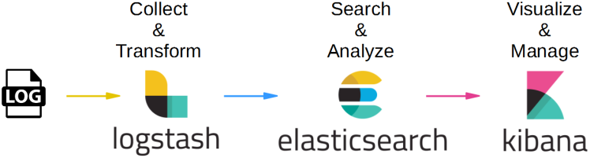
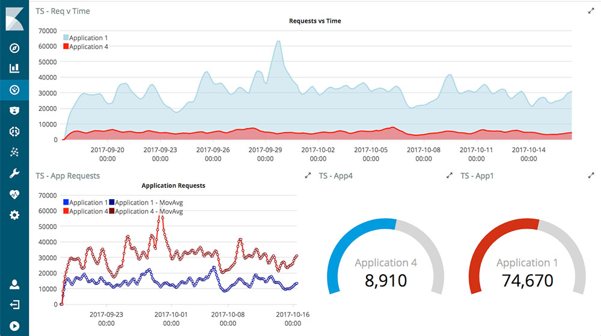
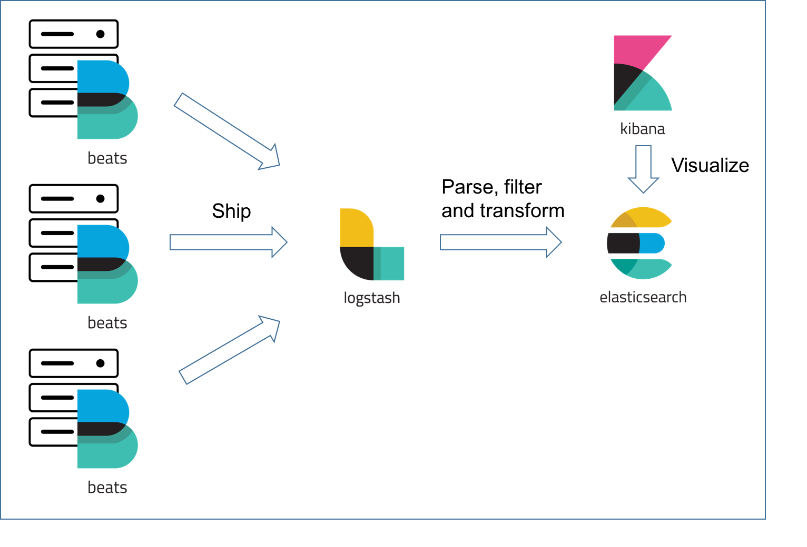
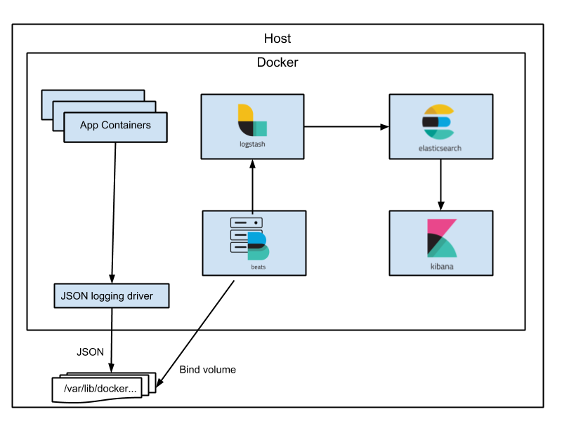
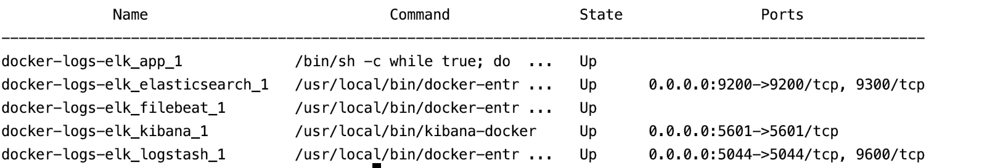
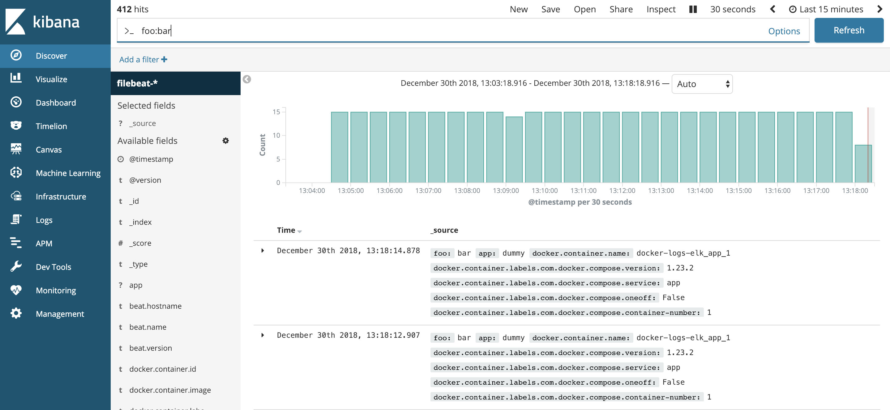
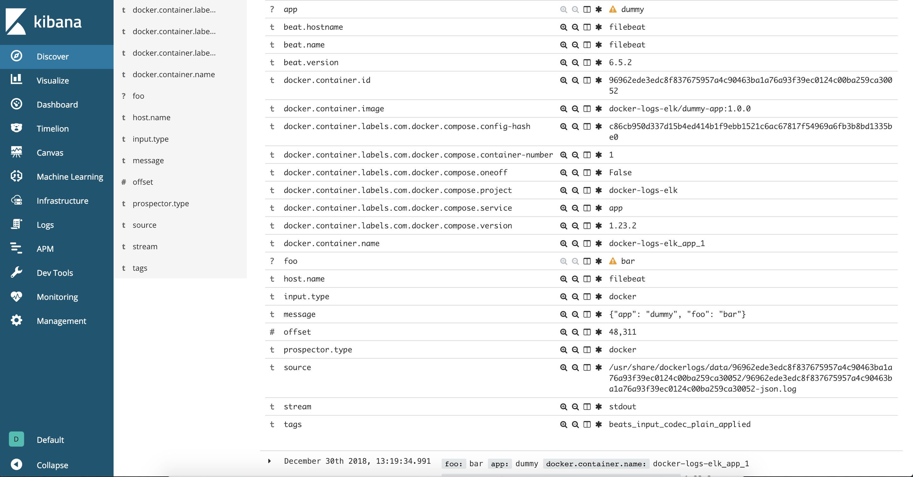

# Collect and analyze Docker logs using Filebeat and Elastic Stack(ELK)

Docker log messages are a very useful tool for a variety of IT tasks but simply using `docker logs` command is often not enough. Even with a few containers running is very difficult to find something useful in logs and even harder when you run docker over multiple machines. The best solution is to aggregate the logs from all machines and containers and then you can easily search through them, analyze them or do anything you want with them. One of the most used tool for this kind of problem is Elastic Stack, also known as ELK.

To complete of this tutorial, I assume you have installed Docker and docker-compose. If you don't have it already, follow the official instructions. This article assumes that the Docker runs natively and the containers are accessible through localhost.

## About ELK

What is ELK? ELK is an acronym for an amazing and powerful collection of three open source projects developed by Elastic.co: Elasticsearch, Logstash and Kibana.

ELK or also known as Elastic Stack is a complete end-to-end log analysis solution which helps in deep searching, analyzing and visualizing the log generated from different machines.

**Elasticsearch** is a distributed search and analytics engine based on the Lucene library. It provides a powerful RESTful JSON-based api, easy to use, scalable and resilient and it stores schema free documents. Elasticsearch is the heart of the ELK stack, it centrally stores your logs.

**Logstash** is a server-side data processing pipeline that ingests data from a multitude of sources simultaneously, parse it, transforms it, and then sends it to the Elasticsearch. Logstash has a pluggable framework with a lot of plugins to transform different inputs, to enriched outputs. For example there are plugins for transforming inputs from jdbc, kafka, log4j and other logs.

**Kibana** is a flexible visualization tool that consumes data stored in Elasticsearch. Using Kibana you can create line graphs, pie charts, histograms and more. In latests versions of Kibana you can use Vega grammar to build your own visualisations. "A picture’s worth a thousand line of logs".

## Filebeat

Filebeat is an open source lightweight shipper for logs written in Go and developed by Elastic.co, same company who developed ELK stack. Filebeat belongs to a bigger project called Beats and his purpose is to send data from hundreds or thousands of machines and systems to Logstash, Kafka, Redis or Elasticsearch. Beats family has shippers for all kind of data, for example:
 * Filebeat - File logs
 * Metricbeat - Metrics
 * Auditbeat - Audit Data
 * Packetbat - Network Data
 * Heartbeat - Uptime Data
 * Winlogbeat - Windows Event Logs
 
Filebeat helps you keep the simple things simple by offering a lightweight way to forward and transform log files using some internal modules(Nginx, MySQL, Docker, System).

## Architecture

By default standard output(stdout) off all docker containers is written into json files. These log files are stored on the host where the docker engine is running, and can be found under the following path `/var/lib/docker/containers/{container-id}/{container-id}-json.log`.

Filebeat will scan files that match the following path `/var/lib/docker/containers/*/*-json.log`,  transform logs and then forwards them out to Logstash. Logstash will filter them, transform them and finally forwards them to the Elasticsearch. Once logs are stored in Elasticsearch, you can use Kibana to build dashboards, to search through logs and all other features supported by Kibana.

## ELK and Filebeat dockerfiles and configuration

Elastic Stack services and Filebeat will run as docker containers. In this tutorial all containers except Filebeat container will be stateless. The strongest argument in favor of stateless container is that deployment is simple and it follows Java principle of “Build once run anywhere”. 
If you built a stateless image you don't need to worry about where to save container state data, or how to make containers interact with persistent storage.

### Elasticsearch Dockerfile

`FROM docker.elastic.co/elasticsearch/elasticsearch:6.5.2`

`COPY --chown=elasticsearch:elasticsearch elasticsearch.yml /usr/share/elasticsearch/config/`

`CMD ["elasticsearch", "-Elogger.level=INFO"]`

### Logstash Dockerfile

`FROM docker.elastic.co/logstash/logstash:6.5.2`

`RUN rm -f /usr/share/logstash/pipeline/logstash.conf`

`COPY pipeline/ /usr/share/logstash/pipeline/`

### Logstash conf 

`input {
    beats {
        port => 5044
        host => "0.0.0.0"
      }
    }`
    
`output {
    elasticsearch {
        hosts => elasticsearch
        manage_template => false
            index => "%{[@metadata][beat]}-%{[@metadata][version]}-%{+YYYY.MM.dd}"
    }
   stdout { codec => rubydebug }
}`

The above configuration file tells Logstash to accept input logs from beats on port 5044 and forwards them to the Elasticsearch cluster. Elasticsearch instances can be found in cluster with hosts named “elasticsearch”. 
In Elasticsearch logs are stored in indexes with the following name pattern beat-{beat version}-{YYYY.MM.dd}

### Filebeat Dockerfile

`FROM docker.elastic.co/beats/filebeat:6.5.2`

`#` `Copy our custom configuration file
COPY filebeat.yml /usr/share/filebeat/filebeat.yml`

`USER root`

`#` `Create a directory to map volume with all docker log files
RUN mkdir /usr/share/filebeat/dockerlogs`

`RUN chown -R root /usr/share/filebeat/`

`RUN chmod -R go-w /usr/share/filebeat/`

The Filebeat configuration file, same as the Logstash configuration, needs an input and an output. This time, the input is a path where docker log files are stored and the output is Logstash.

Filebeat is also configured to transform files such that keys and nested keys from json logs are stored as fields in Elasticsearch. In this way we can query them, make dashboards and so on. Another interesting thing that Filebeat can do is adding some docker metadata to each log, this metadata can be: docker image, service name from docker compose, container id and more.

`filebeat.inputs:
`-` type: docker
 combine_partial: true
 containers:
   path: "/usr/share/dockerlogs/data"
   stream: "stdout"
   ids:
     - "*"
 exclude_files: ['\.gz$\']
 ignore_older: 10m`
 
`processors:
 `#` decode the log field (sub JSON document) if JSON encoded, then maps it's fields to elasticsearch fields
`-` decode_json_fields:
   fields: ["log", "message"]
   target: ""
   `#` overwrite existing target elasticsearch fields while decoding json fields   
   overwrite_keys: true
`-` add_docker_metadata:
   host: "unix:///var/run/docker.sock"`
   
`#` `setup filebeat to send output to logstash
output.logstash:
 hosts: ["logstash"]`
 
 ## Deploy containers
 
 1. `git clone https://github.com/cosminseceleanu/tutorials.git`
 2. `cd tutorials/docker-logs-elk`
 3. Build and start containers using `docker-compose -f docker-compose.yml up -d`
 4. Checking containers status using `docker-compose -f docker-compose.yml ps` and you should have 5 containers
 
 
 
The container named 'app' is a simple bash script that prints the following json {"app": "dummy", "foo": "bar"} message every two seconds. This message will be transformed so that in Elasticsearch, json keys “app” and “foo” will be fields in index and we can use them.

Using Kibana, which can be used accessed http://localhost:5601, under Discover tab write in the search box “foo:bar” and then press enter. You should see messages printed from docker container like in the image below.

Besides the log message printed from our dummy app, the log message is enriched with metadata from Filebeat like: beat.hostname, beat.name, bean.version and more. 
Same as Filebeat's metadata the log will have some docker metadata. This metadata can be used to search logs. For example, you can search using docker compose service `docker.container.labels.com.docker.compose.service: app` or you can search by docker image name `docker.container.image: dummy`.

## Resources:
1. https://docs.docker.com/
2. https://www.elastic.co/guide/en/elasticsearch/reference/current/docker.html
3. https://www.elastic.co/guide/en/beats/filebeat/current/index.html
4. https://www.elastic.co/guide/en/kibana/current/index.html
5. https://www.elastic.co/guide/en/logstash/current/index.html
6. https://docs.docker.com/compose/

