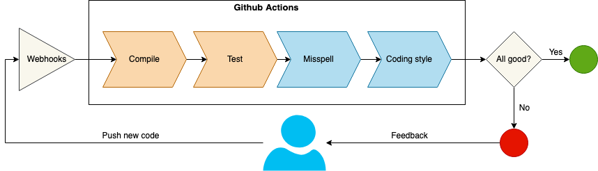
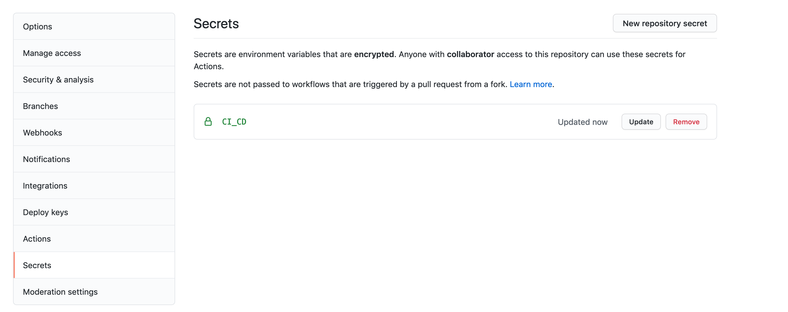

# CI pipeline for a Spring Boot application using Github actions

## Introduction
What is Continous integration? "Continuous Integration is a software development practice where members of a team integrate their work frequently, usually each person integrates at least daily - leading to multiple integrations per day." [1]

What is a CI pipeline? CI pipeline is a series of automated steps that will verify each new line of code pushed to repository to detect errors as soon as possible and to ensure that team/organizations code quality rules has been respected.  

During this tutorial I'll show you how to build a simple CI pipeline for a Java Spring Boot application using Github Actions.

Requirements:
1. Java >= 8
2. Maven
3. Github repository
4. A basic of understanding on github flows, pull requests, forks. [Here](https://guides.github.com/introduction/flow/) is a simple explanation.

## CI Pipeline



CI pipeline will consist on 4 steps important steps:
1. Compile: this step will ensure that the application will compile with the new code
2. Test: this step verifies that all tests will pass
3. Misspell: this step is an optional check that will search misspelled words through the code
4. Coding style: this step verifies that coding style rules are respected by the new code.

## Github actions

Github actions are a great tool to automate, customize and execute CI pipelines for github repositories and they are for free, including for private repositories you will still have 2000 minutes for free.

Let's start building our first Github action, for this all we need to do is to define a yml[3] file into the `.github/workflows` directory. For our CI pipeline I'm going to create 2 worflows: `build.yml` for step 1,2 and `linter.yml` for step 3,4. 


#### Build Action 

```yml
name: Build
on:
  pull_request:
    branches:
      - master
jobs:
  Build:
    runs-on: ubuntu-latest
    steps:
    - uses: actions/checkout@v1
    - name: Set up JDK
      uses: actions/setup-java@v1
      with:
        java-version: 8
    - name: Compile
      run: mvn --no-transfer-progress clean compile
    - name: Tests
      run: mvn test
```

Build action is quite simple, will run on the ubuntu latest OS then will install java and maven and then will run 2 maven commands: `mvn --no-transfer-progress clean compile` for the **step 1** oh the pipeline and `mvn test` for the **step 2**.

The first part of the yml file describes the triggers for the action, and in this case action will start when a pull request to `master` branch is opened.


#### Linter Actions

```yml
name: Linter
on:
  pull_request:
    branches:
      - master
jobs:
  Linter:
    runs-on: ubuntu-latest
    steps:
    - uses: actions/checkout@v1
    - name: Set up JDK
      uses: actions/setup-java@v1
      with:
        java-version: 8
    - name: Run Checkstyle
      run: mvn checkstyle:checkstyle-aggregate
    - uses: reviewdog/action-setup@v1
      with:
        reviewdog_version: v0.10.2
    - name: Run reviewdog check
      env:
        REVIEWDOG_GITHUB_API_TOKEN: ${{ secrets.CI_CD }}
      run: |
        cat target/checkstyle-result.xml | reviewdog -f=checkstyle -diff="git diff master" -reporter=github-pr-check
    - name: Misspell
      uses: reviewdog/action-misspell@v1
      with:
        github_token: ${{ secrets.CI_CD }}
        locale: "US"
        level: info
        reporter: github-pr-review

```

To ensure a coding standard for the Java application I'll use [Checkstyle](https://checkstyle.sourceforge.io/). Checkstyle is a highly configurable development tool that can be used with almost any coding standard and has also support for some of the Java editors, for example Intellij has a nice [plugin](https://plugins.jetbrains.com/plugin/1065-checkstyle-idea) that integrates with Checkstyle.

First step to configure Checkstyle for a Java application is to agree with your team on a coding standard and create a `checkstyle.xml` file with rules. For this tutorial Checkstyle rules files can be found placed under `.idea` directory from the root of the project.


The final step that needs to be done in your Java application is to add the [Maven Checkstyle Plugin](https://maven.apache.org/plugins/maven-checkstyle-plugin/) to Java application. `failsOnError` is set to `false` because the maven command should not fail regardless of violations and leave this responsibility to [Reviewdog](https://github.com/reviewdog/reviewdog). 

```xml
<plugin>
    <groupId>org.apache.maven.plugins</groupId>
    <artifactId>maven-checkstyle-plugin</artifactId>
    <version>3.1.1</version>
    <configuration>
        <configLocation>.idea/checkstyle.xml</configLocation>
        <consoleOutput>true</consoleOutput>
        <failsOnError>false</failsOnError>
    </configuration>
</plugin>
```
The same as build action, the linter action is trigger by a pull request event. The Linter action will also run on Ubuntu OS, uses Java action to run`mvn checkstyle:checkstyle-aggregate` command that scans the project and generates `checkstyle-result.xml` file with violations.
Once checkstyle result file is generated then Reviewdog action is used to report violations to the Github pull request and mark check as failed if there are any violations with **error** level. This is level is configurable, for many details check [Reviewdog](https://github.com/reviewdog/reviewdog) documentation.
 
Reviewdog will add comments to the Github pull request, and he needs some credentials to be able to push those comments. To grant access we need Github Personal access tokens(PAT).
 1. Generate a token [here](https://github.com/settings/tokens), only repo scopes are enough
 2. Go to the Github repository settings and add PAT to `CI_CD` secret - https://github.com/{{username/org}}/{{repository}}/settings/secrets/actions/new 



Last step in this action is a nice job that will check the code for misspellings, personally I do a lot of this mistakes and I found it very useful.

## Demo


## Next steps
- Add a code coverages check. For this you can use https://codecov.io/
- Add a smarter code quality tool - https://www.codacy.com/ or https://sonarcloud.io/
- Add CD pipeline


All the code can be found on [this](https://github.com/cosminseceleanu/tutorials) Github repository.

## References:
1. https://martinfowler.com/articles/continuousIntegration.html
2. https://github.com/features/actions
3. https://docs.github.com/en/free-pro-team@latest/actions/reference/workflow-syntax-for-github-actions
4. https://checkstyle.sourceforge.io/
4. https://github.com/reviewdog/reviewdog
