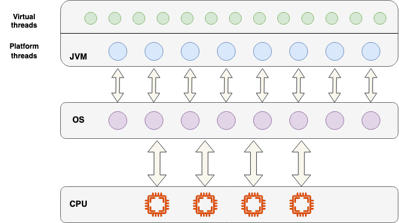
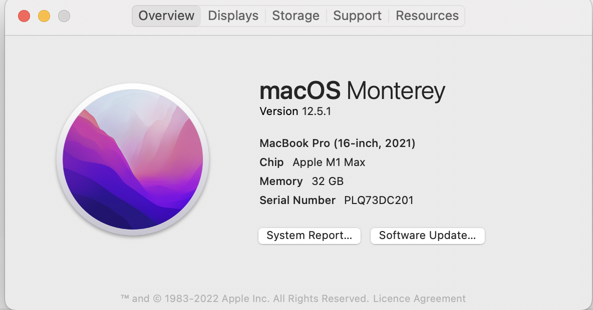
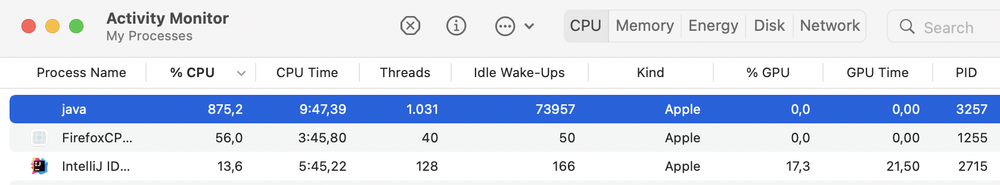
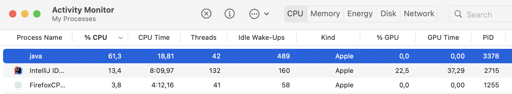
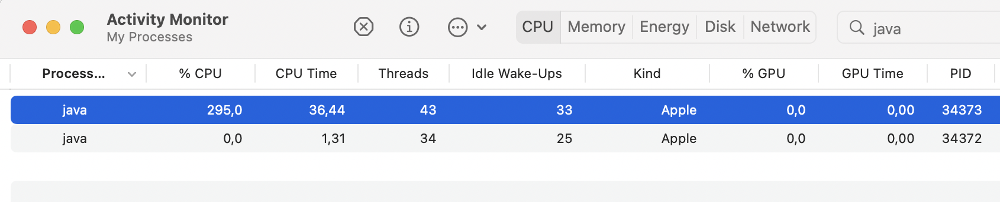
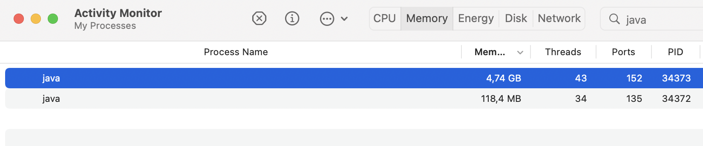

# Introduction

Java Virtual Threads is a new feature introduced in Java 19 that aims to improve the performance and scalability of multi-threaded applications.

Virtual threads provide a lightweight alternative to traditional operating system threads(platform threads), allowing for a larger number of concurrent threads without the overhead of creating and managing a large number of native threads.
This can lead to increased performance and improved resource utilization, especially in situations where a large number of threads are needed.



-----
Additionally, virtual threads provide a simplified programming model for developing concurrent applications, making it easier for developers to write and maintain high-performance multi-threaded code. Overall, Java Virtual Threads is a powerful tool for improving the performance and scalability of multi-threaded Java applications.

# OS threads

Operating system (OS) threads are considered heavy and not scalable because they require a significant amount of memory and resources to create and manage. Each OS thread requires its own stack, which can consume a large amount of memory, especially when there are a large number of threads.
Additionally, creating and managing a large number of OS threads can also place a significant burden on the operating system, causing it to spend more time managing the threads and less time executing the actual application code.

In summary, OS threads are heavy and not scalable because they require a significant amount of memory and resources to create and manage, which can lead to decreased performance and scalability issues when there are a large number of threads.

# Virtual threads

Java Virtual Threads address the bottlenecks associated with OS threads in several ways:

- Reduced memory footprint: Virtual threads use a shared stack, which reduces the memory footprint of each thread, allowing for a larger number of concurrent threads without the overhead of creating and managing a large number of native threads.

- Reduced contention for resources: Virtual threads are scheduled by the Java Virtual Machine (JVM) rather than the operating system, which reduces contention for resources such as CPU and memory, resulting in improved performance and scalability.

- Reduced context switching: Virtual threads do not require context switching between user and kernel space, which eliminates the overhead associated with switching between native and virtual threads, leading to improved performance.

- Simplified programming model: Virtual threads provide a simplified programming model for developing concurrent applications, making it easier for developers to write and maintain high-performance multi-threaded code.

# Programming model

The programming model for Java Virtual Threads is simplified because it is based on the familiar Java Thread API, which developers are already familiar with.

```java
Thread.ofVirtual().start(() -> System.out.println("Hello world!"));
```

Managing virtual threads is also similar to managing regular threads. Developers can use the familiar `join`, `interrupt`, and `isAlive` methods to control the execution of virtual threads.

One major advantage of the programming model is that developers don't have to worry about managing the underlying operating system threads, which can be a complex and error-prone task. The JVM's scheduler takes care of managing the execution of virtual threads, leaving developers free to focus on the logic of their applications.

### Still need thread pools and event loops?

Event loops and thread pools are still useful in certain situations even with the introduction of virtual threads.

Event loops are often used in network programming, for example, in web servers and other types of servers that handle a large number of connections. An event loop allows a single thread to handle multiple connections simultaneously, reducing the overhead of creating and managing a separate thread for each connection. Virtual threads do not eliminate the need for event loops but rather provide an alternative approach to managing concurrency in situations where a large number of threads are needed.

Thread pools, on the other hand, are often used to manage a fixed number of worker threads that are used to execute tasks. Thread pools can be useful in situations where there is a large number of tasks that need to be executed concurrently, and where the number of tasks can vary over time. Virtual threads can also be used to execute tasks, but thread pools provide more control over the number of threads and can be useful when there is a need to limit the number of threads in use.

# Virtual Threads In Action

To demonstrate the advantages of virtual threads more effectively, we can conduct a simple experiment involving the creation of 1000 threads, each performing a dummy task for a brief period of time (a few minutes). The test was carried out on a Macbook PRO 2021 with M1 max chip.



Runnable task:
```java
private static void looper(int count) {
    var tid = Thread.currentThread().threadId();
    if (count > 50000) {
      return;
    }
    try {
      Thread.sleep(10);
      if (count % 100 == 0) {
        System.out.println("Thread id: " + tid + " : " + count);
      }
    } catch (InterruptedException e) {
      e.printStackTrace();
    }
    looper(count + 1);
  }
```

## OS threads

#### Java code

```java
var threads = IntStream.range(0, 1_000)
    .mapToObj(i -> {
      var t = makeThread(() -> looper(1));
      t.start();
      System.out.println(i + " thread started");
      return t;
    })
    .toList();
threads.forEach(t -> {
  try {
    t.join();
  } catch (InterruptedException e) {
    e.printStackTrace();
  }
});
---------
public static Thread makeThread(Runnable task) {
    return new Thread(task);
}
```

#### Result



## Virtual threads

#### Java code

```java
var threads = IntStream.range(0, 1_000)
    .mapToObj(i -> {
      var t = makeThread(() -> looper(1));
      t.start();
      System.out.println(i + " thread started");
      return t;
    })
    .toList();
threads.forEach(t -> {
  try {
    t.join();
  } catch (InterruptedException e) {
    e.printStackTrace();
  }
});
-------
public static Thread makeThread(Runnable task) {
    return Thread.ofVirtual().unstarted(task);
}
```

#### Result




By raising the maximum number of threads to 100K, I was able to instantiate them on my local machine, which marked a significant enhancement as compared to the previous limit of 2.8k OS threads.




# Conclusion

Virtual threads provide an alternative approach to managing concurrency, and developers should carefully evaluate their specific use case to determine if virtual threads are the best solution for their needs.

In summary, Java Virtual Threads is a powerful tool for improving the performance and scalability of multi-threaded Java applications, and it can be used alongside other concurrency mechanisms such as event loops and thread pools, depending on the specific use case.

# References
- https://blogs.oracle.com/javamagazine/post/going-inside-javas-project-loom-and-virtual-threads
- https://cr.openjdk.java.net/~rpressler/loom/Loom-Proposal.html